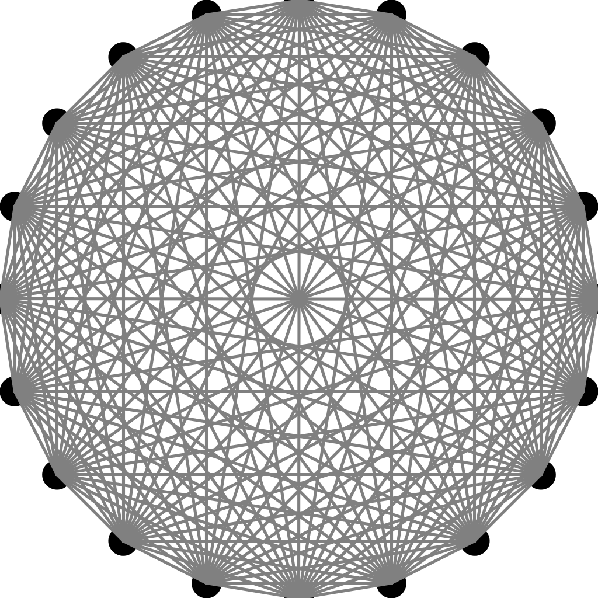

# 1.1 Basic Programming Model

## CREATIVE PROBLEMS

- 1.1.26 *Sorting three numbers*. Suppose that the variables `a`, `b`, `c`, and `t` are all of the same numeric primitive type. Show that the following code puts `a`, `b`, and `c` in ascending order:

```java
if (a > b) { t = a; a = b; b = t; }
if (a > c) { t = a; a = c; c = t; }
if (b > c) { t = b; b = c; c = t; }
```

Move the lowest number to the left(a), than move the next lowest to the second number(b).

- 1.1.27 *Binomial distribution*. Estimate the number of recursive calls that would be used by the code

```java
public static double binomial(int N, int k, double p)
{
    if ((N == 0) || (k < 0)) return 1.0;
    return (1.0 - p)*binomial(N-1, k) + p*binomial(N-1, k-1);
}
```

to compute `binomial(100, 50)`. Develop a better implementation that is based on saving computed values in an array.

N = 0: 1

N = 1: 2

N = 2: 1 + 2 + 4

N = 3: 1 + 2 + 4 + 8

N = 100: 1 + 2 + 4 + ... + 2<sup>100</sup> = 1 * (1 - 2<sup>101</sup>)/(1 - 2)

- 1.1.28 *Remove duplicates*. Modify the test client in `BinarySearch` to remove any duplicate keys in the whitelist after the sort.

```java
import java.util.Arrays;
import edu.princeton.cs.algs4.In;
import edu.princeton.cs.algs4.StdOut;

public class BinarySearch
{
    public static void main(String[] args)
    {
        int[] whitelist = new In(args[0]).readAllInts();

        Arrays.sort(whitelist);

        int n = whitelist.length;
        int j = 0;
        if (n > 1)
        {
            for (int i = 0; i < n - 1; i++)
                if (whitelist[i] != whitelist[i + 1])
                    whitelist[j++] = whitelist[i];
            whitelist[j++] = whitelist[n - 1];
        }

        for (int i = 0; i < j; i++)
            StdOut.printf("%d  ", whitelist[i]);
        StdOut.println();
    }
}
```

- 1.1.29 *Equal keys*. Add to `BinarySearch` a static method `rank()` that takes a key and a sorted array of `int` values (some of which may be equal) as arguments and returns the number of elements that are smaller than the key and a similar method `count()` that returns the number of elements equal to the key. *Note* : If `i` and `j` are the values returned by `rank(key, a)` and `count(key, a)` respectively, then `a[i..i+j-1]` are the values in the array that are equal to key.

```java
import java.util.Arrays;
import edu.princeton.cs.algs4.In;
import edu.princeton.cs.algs4.StdOut;

public class BinarySearch {
    public static int rank(int key, int[] a) {
        int smallerCount = 0;
        for (int e : a)
            if (e < key)
                smallerCount++;

        return smallerCount;
    }

    public static int count(int key, int[] a) {
        int equalCount = 0;
        for (int e : a)
            if (e == key)
                equalCount++;

        return equalCount;
    }

    public static void main(String[] args) {
        int[] a = new In(args[0]).readAllInts();
        Arrays.sort(a);

        StdOut.printf("rank(1, a): %d\n", rank(1, a));
        StdOut.printf("count(1, a): %d\n", count(1, a));
    }
}
```

- 1.1.30 *Array exercise*. Write a code fragment that creates an *N*-by-*N* boolean array `a[][]` such that `a[i][j]` is `true` if `i` and `j` are relatively prime (have no common factors), and `false` otherwise.

```java
import java.util.Arrays;
import edu.princeton.cs.algs4.StdOut;

public class PrimeMatrix {
    public static int gcd(int p, int q)
    {
        if (q == 0) return p;
        int r = p % q;
        return gcd(q, r);
    }

    public static void main(String[] args) {
        int n = Integer.parseInt(args[0]);
        boolean[][] primeMatrix = new boolean[n][n];

        for (int i = 0; i < n; i++)
            for (int j = 0; j < n; j++)
                primeMatrix[i][j] = gcd(i, j) == 1;

        StdOut.println(Arrays.deepToString(primeMatrix));
    }
}
```

- 1.1.31 *Random connections*. Write a program that takes as command-line arguments an integer `N` and a double value `p` (between 0 and 1), plots `N` equally spaced dots of size .05 on the circumference of a circle, and then, with probability `p` for each pair of points, draws a gray line connecting them.

```java
import edu.princeton.cs.algs4.Point2D;
import edu.princeton.cs.algs4.StdDraw;
import edu.princeton.cs.algs4.StdRandom;

public class RandomConnections {
    public static class PointPair {
        public int a;
        public int b;
        public boolean drawn;

        public PointPair(int a, int b) {
            this.a = a;
            this.b = b;
            this.drawn = false;
        }
    }

    public static void main(String[] args) {
        int n = Integer.parseInt(args[0]);
        double p = Float.parseFloat(args[1]);
        int r = 1;    // circle radius
        Point2D[] points = new Point2D[n];
        double degrees = 360 / n;
        StdDraw.setPenRadius(0.05);
        StdDraw.setScale(-1, 1);

        // print all points
        for (int i = 1; i < n + 1; i++) {
            double radians = Math.toRadians(degrees * i);
            points[i - 1] = new Point2D(r * Math.cos(radians), r * Math.sin(radians));
            points[i - 1].draw();
        }

        StdDraw.setPenRadius(0.005);
        StdDraw.setPenColor(StdDraw.GRAY);
        int allLinesCount = n * (n - 1) / 2;
        // number of lines = numebr of total point pairs * probability
        int linesCount = (int)(allLinesCount * p);
        PointPair[] drawnPairs = new PointPair[allLinesCount];

        // create all point pairs
        int k = 0;
        for (int i = 0; i < n - 1; i++)
            for (int j = i + 1; j < n; j++)
                drawnPairs[k++] = new PointPair(i, j);

        // print random pair lines
        for (int i = 0; i < linesCount; i++) {
            int choosenPair = 0;
            do {
                choosenPair = StdRandom.uniform(0, allLinesCount);
            } while (drawnPairs[choosenPair].drawn);
            drawnPairs[choosenPair].drawn = true;
            points[drawnPairs[choosenPair].a].drawTo(points[drawnPairs[choosenPair].b]);
        }
    }
}
```

```
$ javac-algs4 *.java
$ java-algs4 RandomConnections 4 0.5
$ java-algs4 RandomConnections 20 1
```



- 1.1.32 *Histogram*. Suppose that the standard input stream is a sequence of `double` values. Write a program that takes an integer *N* and two `double` values *l* and *r* from the command line and uses `StdDraw` to plot a histogram of the count of the numbers in the standard input stream that fall in each of the `N` intervals defined by dividing (*l* , *r*) into *N* equal-sized intervals.

```java
import edu.princeton.cs.algs4.StdIn;
import edu.princeton.cs.algs4.RectHV;
import edu.princeton.cs.algs4.StdDraw;

public class Histogram {
    public static void main(String[] args) {
        int           n = Integer.parseInt(args[0]);
        double        l = Double.parseDouble(args[1]);
        double        r = Double.parseDouble(args[2]);
        double[]  input = StdIn.readAllDoubles();
        double interval = (r - l) / n;
        int[]     count = new int[n];

        StdDraw.setScale(0, 10);

        for (double i : input)
            count[(int) (i / interval)]++;

        for (int i = 0; i < n; i++) {
            RectHV rect = new RectHV(i * interval, 0, (i + 1) * interval, count[i]);
            rect.draw();
        }
    }
}
```

```
$ cat test
0.5 1 1.5 2 2.5 2.1
$ javac-algs4 *.java
$ java-algs4 Histogram 3 0 3 < test
```

- 1.1.33 *Matrix library*. Write a library `Matrix` that implements the following API:

```
public class Matrix

    static     double dot(double[] x, double[] y)         // vector dot product
    static double[][] mult(double[][] a, double[][] b)    // matrix-matrix product
    static double[][] transpose(double[][] a)             // transpose
    static   double[] mult(double[][] a, double[] x)      // matrix-vector product
    static   double[] mult(double[] y, double[][] a)      // vector-matrix product
```

Develop a test client that reads values from standard input and tests all the methods.

[Matrix multiplication as composition | Essence of linear algebra, chapter 4](https://www.youtube.com/watch?v=XkY2DOUCWMU&list=PLZHQObOWTQDPD3MizzM2xVFitgF8hE_ab)

```java
import edu.princeton.cs.algs4.In;
import edu.princeton.cs.algs4.StdOut;
import java.util.Arrays;

public class Matrix {
    // vector dot product
    static double dot(double[] x, double[] y) {
        int sum = 0;
        if (x.length == y.length) {
            for (int i = 0; i < x.length; i++)
                sum += x[i] * y[i];
        }
        return sum;
    }

    // matrix-matrix product
    static double[][] mult(double[][] a, double[][] b) {
        double[][] ans = new double[a.length][b[0].length];
        if (a[0].length == b.length) {
            for (int i = 0; i < a.length; i++) {
                for (int j = 0; j < b[0].length; j++) {
                    double[] column = new double[b.length];
                    for (int k = 0; k < b.length; k++)
                        column[k] = b[k][j];
                    
                    ans[i][j] = dot(a[i], column);
                }
            }
        }
        return ans;
    }

    // transpose
    static double[][] transpose(double[][] a) {
        double[][] ans = new double[a[0].length][a.length];
        for (int i = 0; i < a.length; i++) {
            for (int j = 0; j < a[0].length; j++)
                ans[j][i] = a[i][j];
        }
        return ans;
    }

    // matrix-vector product
    static double[] mult(double[][] a, double[] x) {
        double[] ans = new double[a.length];
        if (a[0].length == x.length) {
            for (int i = 0; i < a.length; i++)
                ans[i] = dot(a[i], x);
        }
        return ans;
    }

    // vector-matrix product
    static double[] mult(double[] y, double[][] a) {
        double[] ans = new double[a[0].length];
        if (a.length == y.length) {
            for (int j = 0; j < a[0].length; j++) {
                double[] column = new double[a.length];
                for (int k = 0; k < a.length; k++)
                    column[k] = a[k][j];
                
                ans[j] = dot(y, column);
            }
        }
        return ans;
    }

    public static void main(String[] args) {
        In in = new In(args[0]);

        int arrLen = in.readInt();
        double[] x = new double[arrLen];
        for (int i = 0; i < arrLen; i++)
            x[i] = in.readInt();

        arrLen = in.readInt();
        double[] y = new double[arrLen];
        for (int i = 0; i < arrLen; i++)
            y[i] = in.readInt();

        int a_row = in.readInt();
        int a_col = in.readInt();
        double[][] a = new double[a_row][a_col];
        for (int i = 0; i < a_row; i++) {
            for (int j = 0; j < a_col; j++)
                a[i][j] = in.readInt();
        }

        int b_row = in.readInt();
        int b_col = in.readInt();
        double[][] b = new double[b_row][b_col];
        for (int i = 0; i < b_row; i++) {
            for (int j = 0; j < b_col; j++)
                b[i][j] = in.readInt();
        }

        StdOut.printf("x: %s\n\n", Arrays.toString(x));
        StdOut.printf("y: %s\n\n", Arrays.toString(y));
        StdOut.printf("a: %s\n\n", Arrays.deepToString(a));
        StdOut.printf("b: %s\n\n", Arrays.deepToString(b));
        // StdOut.printf("x • y: %f\n\n", dot(x, y));
        // StdOut.printf("a × b: %s\n\n", Arrays.deepToString(mult(a, b)));
        // StdOut.printf("Transpose(a): %s\n\n", Arrays.deepToString(transpose(a)));
        StdOut.printf("a × x: %s\n\n", Arrays.toString(mult(a, x)));
        StdOut.printf("y × b: %s\n\n", Arrays.toString(mult(y, b)));
    }
}
```

```
$ cat test
3
1 2 3

3
4 5 6

2 3
1 2 3
4 5 6

3 2
1 4
2 5
3 6
$ javac-algs4 *.java
$ java-algs4 Matrix test
```

- 1.1.34 *Filtering*. Which of the following *require* saving all the values from standard input (in an array, say), and which could be implemented as a filter using only a fixed number of variables and arrays of fixed size (not dependent on *N*)? For each, the input comes from standard input and consists of *N* real numbers between 0 and 1.

    0. Print the maximum and minimum numbers.
    1. Print the median of the numbers.
    2. Print the k th smallest value, for k less than 100.
    3. Print the sum of the squares of the numbers.
    4. Print the average of the N numbers.
    5. Print the percentage of numbers greater than the average.
    6. Print the N numbers in increasing order.
    7. Print the N numbers in random order.

    All values: 0, 1, 3, 4, 5, 6, 7

    Filter: 2
